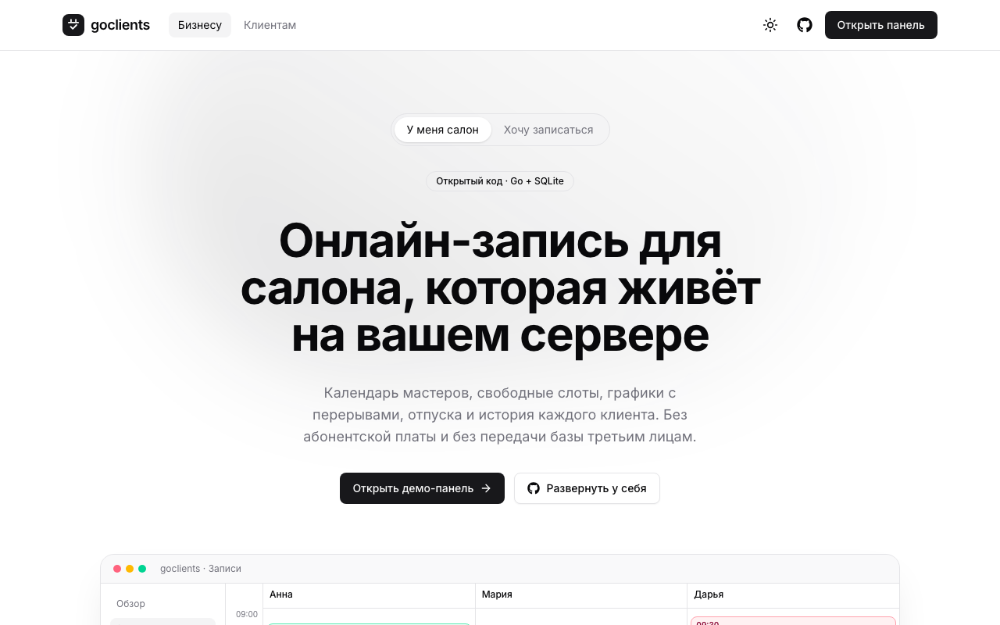
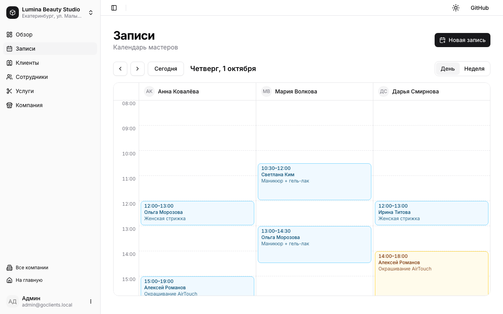
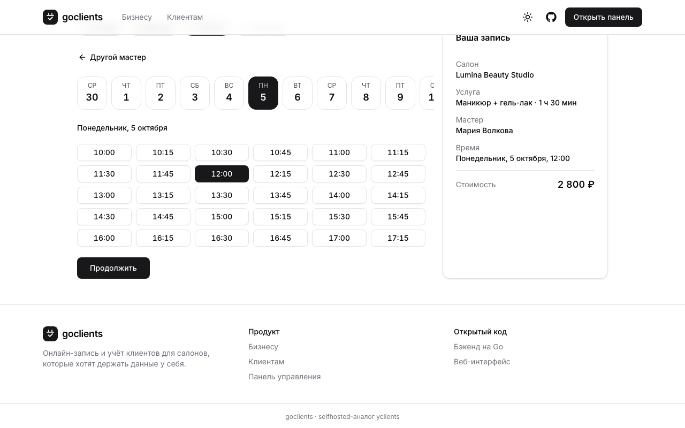

# goclients-web

Веб-интерфейс для [goclients](https://github.com/artemydottech/goclients) — selfhosted-аналога yclients на Go и SQLite. Здесь лендинг, публичная онлайн-запись и панель управления салоном.



## Что есть

**Панель управления** (`/dashboard`)

- компании с часовым поясом, адресом и соцсетями;
- календарь записей: день по мастерам и неделя целиком, линия текущего времени, нерабочие часы, перерывы и отпуска;
- перенос записи перетаскиванием в дневном виде, в том числе к другому мастеру;
- создание записи по свободным слотам, перенос, смена статуса по правилам бэкенда;
- сотрудники: недельный график с перерывом, отпуска и больничные, привязка услуг;
- «Мой день» мастера со списком записей и быстрыми статусами;
- услуги с ценой и длительностью;
- клиенты: поиск по имени и телефону, статистика визитов, история записей;
- обзор с метриками за сегодня и неделю.

**Онлайн-запись** (`/book`): клиент выбирает салон, услугу, мастера, день и слот, оставляет имя и телефон. Дни без свободного времени неактивны, есть переход к ближайшему свободному дню.

**Лендинг**: `/` для владельцев салонов и `/for-clients` для клиентов.





## Запуск

Нужен запущенный [бэкенд goclients](https://github.com/artemydottech/goclients):

```bash
git clone https://github.com/artemydottech/goclients.git
cd goclients && cp .env.example .env && go run .
```

Фронтенд:

```bash
cp .env.example .env
npm install
npm run dev
```

| Переменная | По умолчанию            | Назначение                               |
| ---------- | ----------------------- | ---------------------------------------- |
| `API_URL`  | `http://localhost:8080` | адрес бэкенда, на него проксируется `/api` |
| `SITE_URL` | `http://localhost:3000` | публичный адрес для sitemap и OG-тегов   |

Бэкенд не отдаёт CORS-заголовки, поэтому браузер ходит в `/api/*`, а Next.js проксирует запросы через `rewrites`.

## Скрипты

```bash
npm run dev        # dev-сервер
npm run build      # production-сборка
npm run lint       # ESLint
npm run typecheck  # tsc --noEmit
```

CI в `.github/workflows/ci.yml` прогоняет lint, typecheck и build на каждый push.

## Стек

Next.js 16 (App Router), React 19, TypeScript, Tailwind CSS 4, shadcn/ui, TanStack Query, React Hook Form + Zod, dayjs, sonner, next-themes.

## Структура

```text
app/
  (marketing)/         лендинг и публичная запись
  dashboard/           панель управления
components/            компоненты по фичам, components/ui — shadcn
forms/                 формы: index, fields, validation, types
services/
  api/<domain>/        запросы axios, бросают ApiError с готовым текстом
  queries/<domain>/    useQuery-хуки
  mutations/<domain>/  useMutation-хуки с инвалидацией кэша и тостами через meta
hooks/                 общие хуки
utils/                 форматирование, даты в поясе компании, статусы записей
```

Время хранится в UTC, а показывается и отправляется в часовом поясе компании (`utils/date.ts`).

## Ограничения API

Интерфейс работает с тем, что сейчас отдаёт бэкенд:

- **нет авторизации** — панель открыта всем, кто видит адрес;
- **нет эндпоинтов обновления** — компании, услуги, сотрудники и клиенты только создаются и удаляются;
- **нет фильтра сотрудников по компании** — список фильтруется на клиенте;
- **нет поиска клиента по телефону** — публичная запись загружает клиентов компании, ищет совпадение по номеру и создаёт нового, если не нашла.
